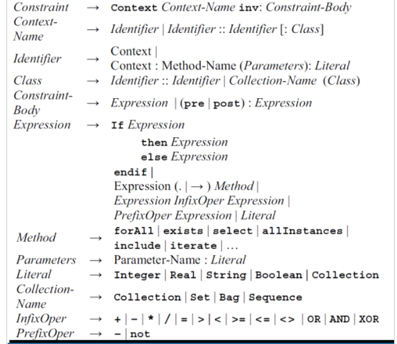
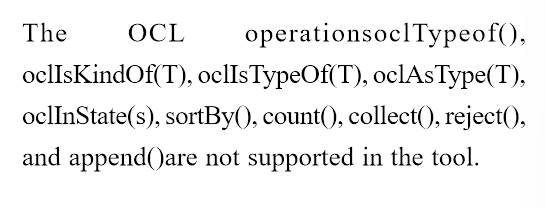
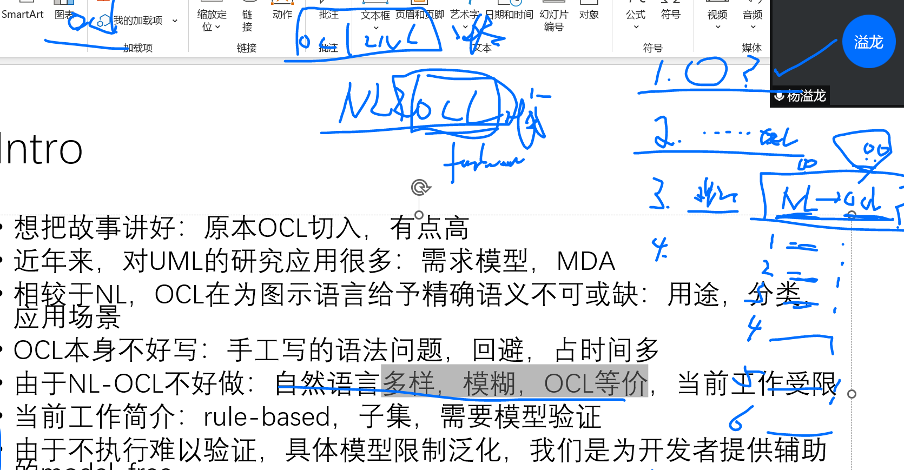
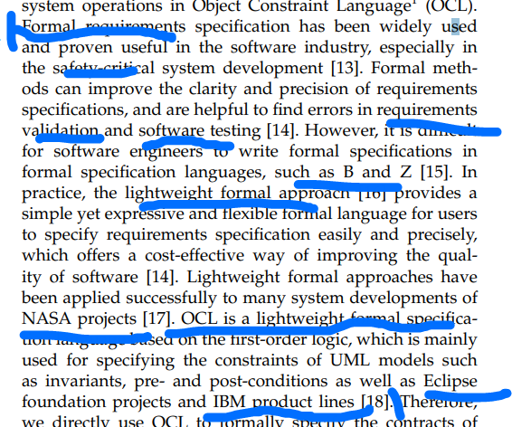

这是Bajwa 有关OCL 生成工作的笔记

<!--more-->

endow 资助 赋予

expertise 专业知识

# 2010

OCL Constraints Generation from Natural Language Specification

通过英语生成约束和前后条件

主要问题：将自然语言形式化：SBVR

使用 LESSA [14]（用于语义分析的语言工程系统）方法对 NL 表示进行语义分析

解析自然语言，将自然语言的部分映射到对应的SBVR规则上

将名词，动词，形容词映射到类，实例，方法和属性，也有规则

 

读取XMI作为目标UML类模型的输入，将SBVR映射到类模型

## 2012

Translating natural language constraints to OCL

基本没什么区别 方法说的更详细一点 还补了几个经验性的判断

# 2017

**Automated Generation of OCL Constraints: NL based Approach vs Pattern Based Approach**

通过对自然语言的语法和语义分析 得到SBVR为基础的半正则表达，下来就很容易翻译成别的了。

研究趋势：

手动将英语约束映射到OCL

遇到的问题：

1. 用到的英文词汇必须是系统中有的
2. 英语同样具有歧义性
3. 如果英语没有问题 那么就可以自动生成了

限制/不足：

* NL不应包括UML类图以外的词汇，名字也应该一致
* 不完整，无效的就不行
* 不能包括UML聚合
* 不能有带参数的函数调用
* 异或关系不支持
* 
* query based 不可以
* 对于有歧义的句子不太行
* 需要用户手动纠正
* 只能处理一个句子

OCL用的少：

introducing a template based language：

3 Wahler, M., “Patterns to Develop Consistent Design Constraints”, Ph.D. Thesis, ETH Zurich, Switzerland, 2007.

OCL困难的语法：

4 Gogolla, M., Büttner, F., and Richters, M., “USE: A UML-Based Specification Environment for Validating UML and OCL”, Science of Computer Programming, Volume 69, No. 1, pp. 27-34, 2007.

同义可以有多个实现

[5] Cabot, J., “Ambiguity Issues in OCL Postconditions”, Proceedings of 6th Conference OCL Workshop at the UML/MoDELS, pp. 194-204, 2006. 

[6] Kristofer, J., “Disambiguation Implicit Constructions in OCL”, Conference on OCL and Model Driven Engineering, Lisbon, Portugal, pp. 30-44, October 12, 2004.

大型软件建模中可能有OCL的理解性问题

[7] Correa A., Werner, C., and Barros, M., “An Empirical Study of the Impact of OCL Smells and Refactorings on the Understandability of OCL Specifications”, MODELS, LNCS 4735, pp. 76-90, 2007.

template based approach (the Copacabana [27] too

Raj, A., Prabharkar, T., and Hendryx, S., “Transformation of SBVR Business Design to UML Models”, ACM Conference on India Software Engineering, pp. 29-38, 2008.

# Constraint Detection in Natural Language Problem Descriptions

rigorous 严密的

alleviate 减轻 缓和

tailored 定做的 时尚的

substantial 重要的

insubstantial 毫无疑问的

目的：

Automated model reformulation aims at assisting a naive user in modeling constraint problems.

做的事：

detecting constraints in natural language problem descriptions using a structured-output classifier.

检测文本中描述约束的部分？？

主要的工作内容就是使用SVM-HMM进行了对于输入文本中，标注出描述的约束部分，算是一个文本提取/标记问题

# Automating Inference of OCL Business Rules from User Scenarios

OCL的作用：

OCL could be employed in several other cases such as (1) to describe pre- and post conditions of operations, (2) to give restrictions as guards in a state transition system and (3) to query over a given system state with OCL queries [4].

做的事：

generate the ocl business rules, invariants  from the conceptual model for the designer,use the predefined ocl invariant pattern and the snapshots of the conceputal model

# Bidirectional Translation between OCL and JML for Round-trip Engineering

OCL 和 JML 的双向翻译 保持OCL的原有形态

# OCL Constraints Automatic Generation for UML Class Diagram

use predefined template and lexcial analyse to generate simple ocl constraints for input uml xmi

# Generating OCL Constraints from Test Case Schemas for Testing Model Behavior

形式化合约的重要性——引出OCL

项目验证，测试用例生成

OCL是轻量化的合约——OCL重要性

现状：难写难读，

需要一个辅助写对的东西

干这个事情的难点：

NL的二义性

本身不那么直接对应——OO-类

六点……

现有工作对难点的应对情况：那些解决好，哪些解决不好：限制分析清楚

我们的工作提出方法 应对他们的缺陷

