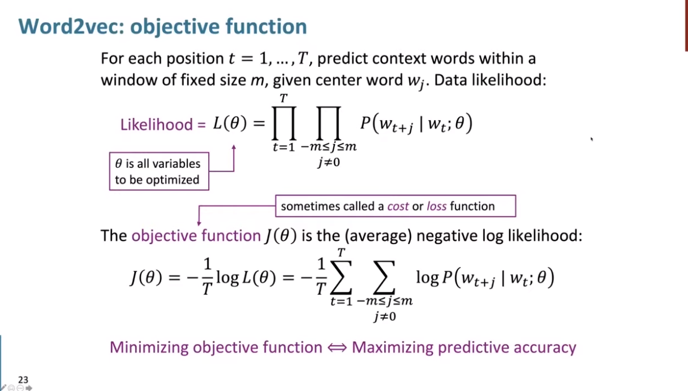
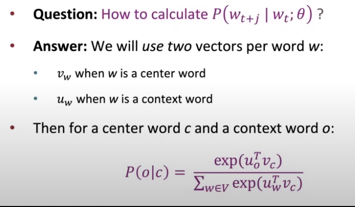
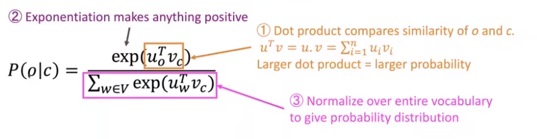
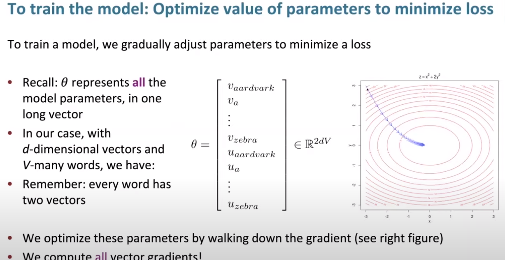

这是Stanford 课程CS224N的学习笔记 可能还有一些别的。
Winter, 2021 https://web.stanford.edu/class/archive/cs/cs224n/cs224n.1214/
<!--more-->
enamor 迷恋

zoom in/out 缩放

fiddle 调整，伪造

likehood 似然——给定结果求某参数的可能性

open region 开区间

amplify 放大（扩增）

partial derivative 偏导数

denominator 分母

arithmetic 算术

analogy 类比 比喻

# L1

最早：类似于WordNet：手工编写的词汇关系-hierathy and synomy ——依靠劳动，无法随时更新，无法衡量相似性

——离散的单独符号表示——one hot encode 高维向量——希望可以用稠密向量dense vector衡量相似性

**morden statical NLP:**

distributional semantic——Represent a word meaning by its context(a fix window)

不可能由人类来手工编写：

## Word2Vec:

### 思路

给定中心词，最大化周围context 的概率：(i.e. 调整中心词向量)

条件概率，左右词汇的概率连乘

目标是最小化损失函数：

-log avg

log  是因为处理和比积方便

### 如何计算条件概率？

* 根据用途 用两个向量表示一个词
* 正则化除法用的是整个词典的概率

### 所以要如何得到向量呢？

想要得到向量 就是要优化模型，考虑向量维数D，每个词向量个数2和词典大小V，就是有2DV的总参数量需要优化，使用梯度下降

