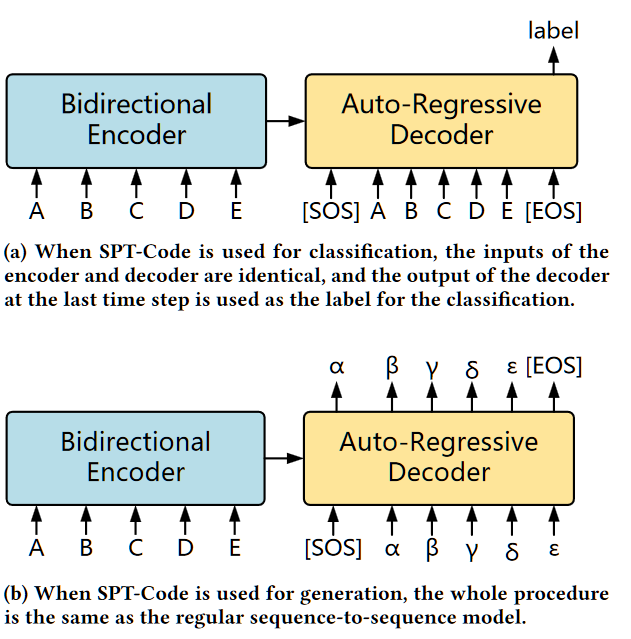
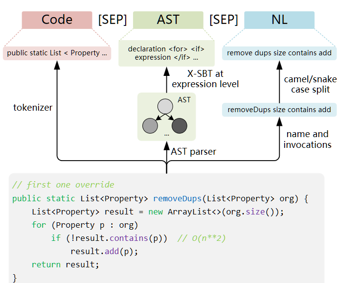
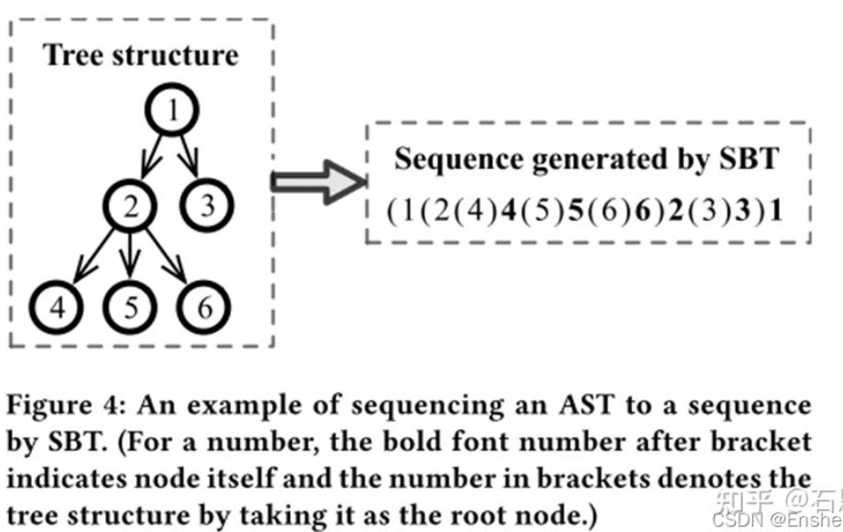
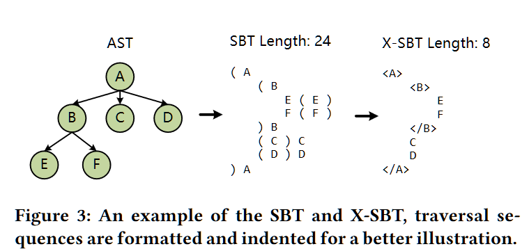
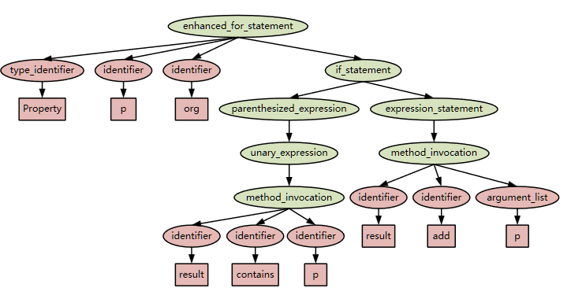

这是《Sequence-to-Sequence Pre-Training for Learning Source Code Representations》的读书笔记

<!--more-->

# Abstract

Pre-trained models 用于代码相关下游任务的应用时的 问题？

1. 仅用了Pre-trained encoder 但生成任务需要两个部件都预训练
2. 现在许多Pre-trained model 包括T5，只是简单复用了NL的预训练任务，这要求NL-CODE的corpus 这使得数据受限

为了应对这两个问题 提出了SPT-Code ，在微调后可以在5个代码相关任务上SOTA

这是一个seq2seq 预训练模型，通过三个预训练任务使得其能够学习到下面三点，并在下游任务中使用

* 代码知识
* 对应代码结构
* 自然语言描述

而不需要双语corpus

# Introduction

作者在第一部分提了自监督训练，然后说预训练模型的成功和这个有关系，下面谈预训练模型到软工SE任务的时候认为的问题是：

* 主流预训练模型仅对encoder搞 ，不够理想

  最有名的encoder也就是BERT吧 也确实就是用了MLM（Masked Language Modeling） 也确实有好多Pre-trained Bert 下面套个任务头或者另一个decoder就开干的……不过这应该算是蛮荒时代了 T5虽然好 但是对一般研究人员来说想改进模型architecture 不是那么容易？

  * 别人的解决：

    T5-learning , TreeBERT 两个工作使得Encoder-Decoder jointly trainded

    

* 这些预训练模型预设输入的是NL-CODE 忽视了代码结构

  为什么呢？因为就是简单偷了NLP的拿来用

  * 别人的解决：

    专门的预训练任务 包括预测数据流图中的边与对齐节点和代码 

    ——dataflow 有语义信息而无语法信息（AST）

* 而且都假设有严格对齐的双语语料

  * T5-learning :

    分别处理两种输入，不要求语料库中展示二者的关系

—— 没有一个模型能够统一处理这三个问题

SPT-Code就可以！

* 这是一个encoder-decoder共同预训练的模型
* 数据实例由CODE,AST,NL三部分构成
* 使用方法名和调用此方法的方式作为自然语言描述（以避免对bilingual corpus的依赖）

方法：

设计了三种预训练任务，每一种获取一种数据信息

* 改进的MASS-用于CODE：遮蔽Seq2Seq恢复
* Code-AST Predict CAP：预测code-AST是否匹配
* Method Name Generation MNG：生成 方法名的 子token

数据集：

CodeSearchNet

贡献：

1. 提出了SPT-Code预训练模型，可用于分类和生成任务
2. 使用了线性和简化的AST 第一个使用了NL&AST作为输入对于预训练
3. 通过输入表示和三个与训练任务使得预训练模型不依赖双语语料库（labeled data)
4. 用未标注数据库在五个下游任务实现了SOTA

# 方法

架构，输入和预训练任务，微调

## 架构

类似于BART和T5的典型Transformer

分类任务和生成任务，模型采用相同的输入：

* 分类对encoder和decoder输入相同
* 生成采用传统方法

## 输入

由三部分组成，每一部分[SEP]连接

### Code：

没有使用笨蛋tokenizer，而是用了stl for Python 或者 antlr for Java,Php.etc 其他的用了NLTK

###  AST

用的Tree-sitter 搞的 AST 

 如何序列化AST?

* 传统方法：SBT （Structure-Based Traversal)

  比先序遍历之类的更有效，但可能产生过长的序列（可能超过代码三倍长）

  

  

      一种类似中序遍历的说法 来自那篇论文忘了 反正绝对看过
  

  
  
* 本文的方法：X-SBT：XML-like SBT

  可以减少超过一半的长度

  

  论文自带的图好看一点 这个创新点……只能说是情理之中，毕竟原来那个也太呆了（作者甚至还装模做样证了一下必然更短）

  为了更短: AST——XSBT时，仅取表达式级别以上节点，放弃终结符

  

  **这种优化为可接受的，为什么呢？下面这个说得很漂亮：**

  AST中包含了语法信息和词法信息，舍弃掉终结符丢失了词法信息，但之前的token（Input中Code的部分）都是词法单元，所以这个信息是没有丢掉的，因此改进可接受

### NL

难点：从仅有CODE中提取NL

方法：获取方法名与调用的API序列

对驼峰和下划线命名掰开

问题：怎么提取的API序列：从AST里偷出来的？

——应该就是

## 预训练任务

𝐼𝑛𝑝𝑢𝑡 = 𝐶,[SEP],𝐴,[SEP],𝑁 

### Code-AST Prediction.

这是第一个

在构建输入𝐼𝑛𝑝𝑢𝑡 时，一半是对应的AST,一半是随机的AST

### MASS

随机遮蔽C中的一部分，将所有遮蔽的token设置为[MASK]（改进前为对应数量个[MASK])

根据别人的论文，最大遮蔽长度是C长度l的一半

### Method Name Generation

希望可以通过这个任务学到代码的动机

代码名的词汇和对应代码总结的词汇由高度相关，因此希望通过改善 预测代码名 这一任务提升 代码总结 的能力

此任务的输入时，从𝐼𝑛𝑝𝑢𝑡中的C扣掉对应token，并在N中去掉前s个token（方法名总在最前），作为输入，试图让decoder输出扣掉的前s个token，即方法名

## 微调

端到端 根据不同任务分成两类，分类或生成，不同任务就缺掉一点输入

# 实验

## 预训练

交代了数据集的数据使用，任务顺序，epoches，用的cross-entropy loss和Adam-W，batchsize和显卡（……）

Tokenizer Encoding 用的BPE对CODE和NL，在预训练data上干过 每个下游任务照用

预训练任务的任务量都是每个任务几十个Epoches的量级。

问题：不是都有token了 还tokenize？

——低级问题，前面的应该是tokenize，这里进行token=>input_ids的步骤

## 下游任务微调

介绍了五个任务 其中介绍部分有点尴尬

## 评估

RQ1:相比于其他较好的基线 这个性能在下游任务如何？

列个表 比不上人家的扯一点

RQ2:三个预训练任务对五个下游任务分别有什么贡献？

——消融实验

有趣的是 删除掉MNG （生成 方法的token）在代码完成和代码修复上性能有所提高：

* MNG是目标自然语言的预训练，而这两项任务都是代码到代码

分析一下 什么任务对什么下游有影响

**稍微有点水平的问题**

RQ3: 可以利用更多无标记的资料是不是本模型的优点呢？

相较于别的预训练模型，由于它的设计，可以使用无标注数据。更好的性能是不是来自于更多的数据呢？（而不是模型本身厉害？）

在同样的数据集上训练——把它当作无标注的——其实和别的比还算吃亏——也能够取得相对别的模型更好的结果。

可以说是赢两遍了。

RQ4:微调阶段的数据量对下游任务有什么影响？

虽然越小越坏，但是很小也和别的模型差不多 说明真好

## 定性分析与定量分析

定量：志愿者评估，多个样本分类列表个

定性：在哪些任务哪些方面表现好 不好的怎么不好

# 威胁分析

构造：数据集可能有重复

内部：没调过超参数：所以可能有更好的

外部：只用了CodesearchNet

# 总结：

我们介绍了SPT-Code，这是一个基于编码器架构的源代码的大型型号。首先，我们为预训练SPT代码设计了三个特定代码的预训练任务。其次，我们提出了一种新的输入表示形式，它是第一个考虑自然语言和AST形式的方法，我们还提出了AST遍历方法的改进版本XSBT。我们的预训练任务和输入表示形式都允许在完全未标记的数据集上预先训练SPT代码。然后，对五个与代码相关的下游任务进行了微调。结果表明，微调SPT代码使其能够在五个与代码相关的下游任务上实现最新性能。消融实验表明，这三个预训练任务对不同的下游任务具有不同程度的影响，AST和自然语言输入也有助于提高SPTCODE的性能。为了促进未来的研究，我们还可以在https://github.com/ nougatca/spt-code上公开提供代码和其他。

