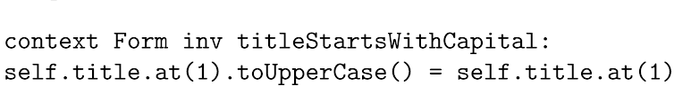

硕士论文

Usage Analysis of the Object Constraint Language in Model Driven Engineering

的阅读笔记 

和OCL总结性质的教程

<!--more-->

# 论文笔记

本篇是某硕士论文

Usage Analysis of the Object Constraint Language in Model Driven Engineering

的阅读笔记 ，主要目的在于总结OCL的特点及用途

后面还有一点OCL总结性质的教程


## ABS

在MDE中，元模型和模型转换很重要

OCL用来给元模型表达操作和约束

目前的OCL经验研究都在小数据集上，我们收集了100k的数据集，研究人们的用途和代码的不同。研究手段包括：表达式的不同分布，表达式的复杂度与常用的结构

还研究了可维护性


## 1

### INTRO

OMG利用OCL在许多其他语言的规格中进行标准化

### MDE

MDE将系统的抽象程度从代码提升到模型

OMG提出 MOF ，Meta Object Facility，元对象机制作为建模语言的标准

### OCL

对模型有限制：比如某个属性只能是大写的

这就是对OCL的需求

是文本语言可以用来写宣告性表达

约束模型的属性或者关系

作为UML的标准，最开始的目标是克服系统设计中的指定细节的不足

也被和model transformation languages 一起使用




context：self指的实例，也就是说哪一个类

Inv：这一段是个不变量，必须为真，要不然模型的状态就是无效

=用于检查而非赋值


`self` 是否可以省略？

可以


这三个等效

可以省略`self`? 

`allInstances（）`是什么？


### 问题描述

OCL约束可能很长很复杂，降低了维护性和阅读

同样的意思可以有多个OCL写

规范性和复杂性也与元模型的设置油管

想提供一个guideline 让人们会写好OCL

给出一些常用和少用的模式

比较不同来源的OCL

### RQ

RQ1: How are developers using OCL?

复杂度 ，目的和结构/模式


RQ2: What maintainability measures are there for OCL code?

RQ3: What are the differences in OCL usage among different sources?


## Related Work

### refactoring OCL to improve maintainablity

关于 Code Smell的：

magic literal, and chain, long journey, rules exposure, duplicated code.

implies chain, redundancy, non-atomic rule, verbose expression, forAll chain, downcasting, type-related conditionals.


讲了一些重构的研究，方法，还按是否改变context来把方法分为两类

### co-evolution

元模型改变（UML改变） 而对应的OCL需要协同改变

两种办法：

* 使用模板来写OCL 这样 工具就知道怎么改变了

  全自动，但开发者就受到了限制

* 让开发者从侯选中挑选

  半自动

### OCL 用途

讲了一些相关的文献


## Methodology

### 1 How use

#### EMF 

EMF Eclipse Modeling Framework ,核心是Ecore meta-model

是MOF的一个实现

Acceleo 

z主要适用于model-text转换 算是一个技术


后面的result分析懒得读了 干脆把网站上学OCL的笔记也写在这里


# OCL tutorial

* 所有的表达式都没有副作用

* 没有表达式的终结符

* \- \- 单行注释

* :: 表示某个聚合中的元素

  

* context指代模型中的任意元或子元素

* self 指代当前对象


* Invariant:

  

  `inv`是必要的 inv名字是可选的，为了要多写几条可以use `and` to conjunct

  


* Pre and Post

  

  @pre refers to before

  `result` is a **resevered**  word for operation

  ? really the resevered word?

  - yes

  

  `result` corresponding to `self`

  

  

  name is optionnaly

  
  
  what is used to describe a **operation** ?
  
  - other language, not ocl

​		

​		

why `income` use `::`?

类的方法就可以？


* Query

  

  `body` is the reserved word

  

* Definition

  


### Collection


able to convert with the built -in method


#### navigation

dot `.` can refer to its property or the relationship partner. for the relationship , the type of return varies from the number of nested relationship  


#### Expressions


nested set will be flattened


`->` is used to call the operation of the collections

**also the loop**


index started from `1`

### Loop


`collect(expr) ` return a bag containing the item match the expr


`forAll`has a `iterator` and a `acc`

Equal：


### Let：


let xx=yy `in`


`in` is used to point out the scope(作用域)?


How many reserved words?

Key words are reserverd words


```
and, attr, body, context, def, else, endif, endpackage, if, implies, in, inv, let, not, oper, or, package,
post, pre, then, xor
```


## 问题：

.allInstances（）是什么？不是集合的内置函数？会返回这个类的所有实例？

- 不是 是用于类的，会返回所有实例，应该算OCL预定义方法

Let 的 in 是否规定了作用域？

- 是

self 真的可以省略吗，任何情况？


怎么理解这种forall的两个迭代器？

- 不太好用迭代器来说，大概理解是任意两个对象


what is the `stereotype` here?


是这样吗？？ 默认可以不用collect？

——应该是 想要一个属性可以直接用dot 的导航来代替collect
