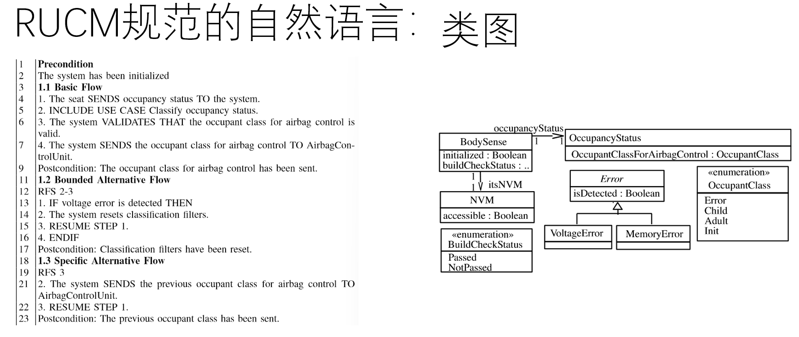
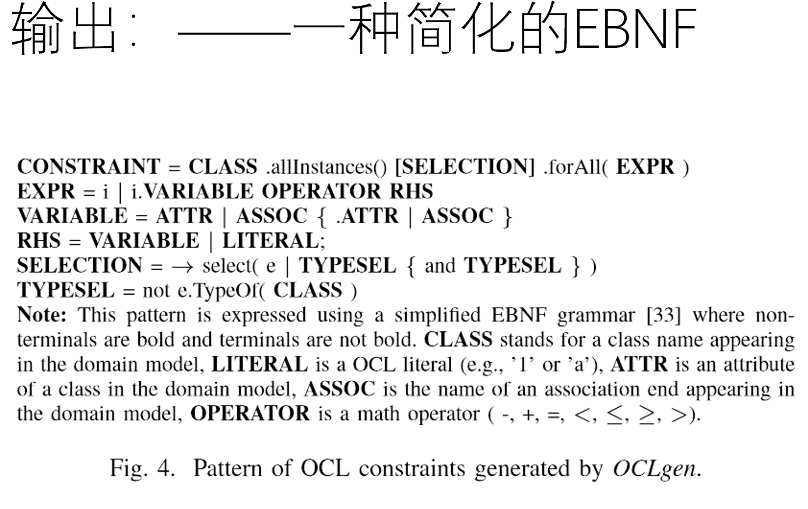
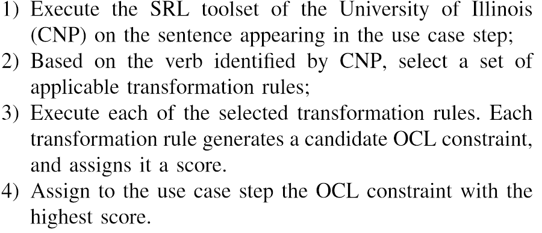
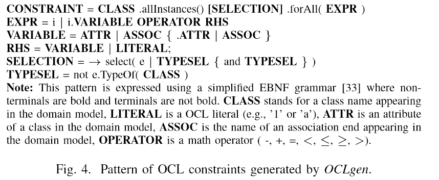
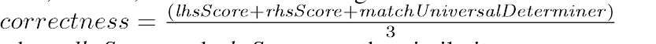
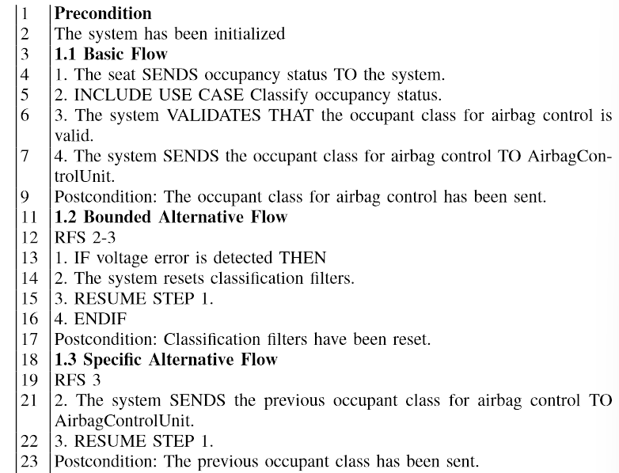
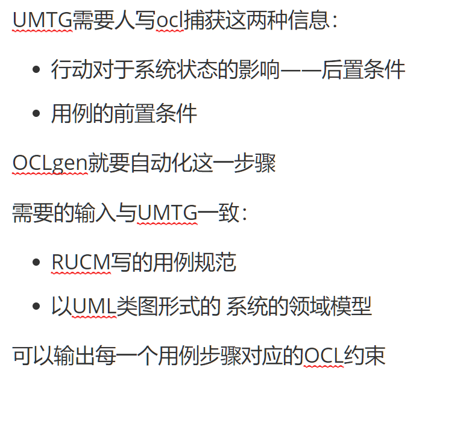
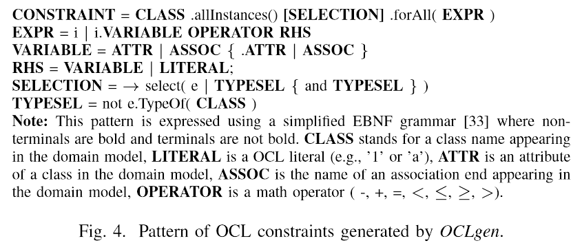

后记：

这篇文章真没搞懂 看的时候觉得实在有点车轱辘话嗯说 前面说UMTG只要RUCM和OCL 后面说OCLgen的输入还需要类图……

前面说verbnet里也不全是同义词 后面又说都是同义词

前面说这个可以转换所有语言 后面就是简单推测了一下用较少规则可以转换好多 而现在还只实现了较少的较少……

当然 也可能是我水平还不够看得颠三倒四 总之 就只是把他非常「作为手段地」分析了一通

<!--more-->

* 这篇文章要解决什么问题？
  * 需要从自然语言的需求规范中自动生成可执行测试用例，使用UMTG工具
  * UMTG需要的东西：RUCM的自然语言规范和OCL写的约束
  * OCLgen就要生成OCL约束——主要是前后置条件

* OCLgen的输入输出是什么？
  * 输入：UMTG一致(?)——RUCM的NL和UML类图的系统领域模型
  * 输出：每一个用例步骤对应的OCL约束

* 它厉害在哪里？
  * 别人的方法 要使用CNL（受控的自然语言）来写软件要求，即，采用有限的动词
  * 他的方法——需要UMTG格式的语言——但不限制动词，还需要类图
  * 在测试的工业案例中，可以达到75%的正确
  * 使用了语义标注和同义词合并的方法，使得只需要很少的规则就可以实现大范围的转换
* 他的方法是什么？

  * 先用SRL（语义角色标注）标记句子中词汇的角色
  * 识别到之后 根据一定的规则再去识别类或自然语言中之中别的属性和操作符
  * 还有通用的——元动词转换规则——因为目的是生成测试用例
  * 然后（如果能生成多个）就打分评估最好的输出
  * 打分方法：完整性和正确性——用例中角色在OCL中出现的比例，变量名和用例名一致(**这里完全没搞懂**)
* 他的评估方法是什么？

  * 比较了生成的和手动编写的 比较了正确率
  * 对于需求 说了87个测试中生成除了多少
  * 
* 他的不足在哪？
  * 聚焦于前后置条件 主要测试场景就是这个工业案例 所以对输入有预设，对输出有范式
  * 吹得很猛 不需要限制 可以处理所有 其实目前只实现了7类规则，可以处理408个动词
  * 对语言的规格还是有需求 需要输入UML类图
  * 实验很弱
* 有什么启发？
  * 比较的时候 应用场景 生成的灵活性都会比他好不少
  * 对于方案设计启发不大

目的：

从自然语言的需求规范中自动生成系统测试用例

——》

为UMTG生成其需要的正则标准，提出了OCLGEN

使用语义分析技术来识别用力规范的前后置条件

可以75%正确生成前后置条件

系统测试很重要 其测试用例要展示功能和安全需求，

软件需求用NL写，然后由工程师手动转换，昂贵且易错

现有的自动化解决方案依靠限制过的，简单的自然语言解决

别人的方法（生成测试用例的）：

基于特殊关键词侦测，如 if then=>抽象，高层次 给测试人员

用受控的自然语言(CNL)写软件规格,再基于规则转换为正则标准=>可用语言非常有限

不用CNL 但需要其他的建模工作——UMTG就是这样的

OCLgen——捕获语句中的后置条件或前置条件——采用了文本转换规则，依赖自动语义分析技术，无需受控语言

SRL（语义角色标注）实现词汇的标注，例如，收到动作最直接影响的成员就应该出现在后置条件中

同义词识别，判断不同的词汇能否用相同的规则处理

在测试的工业案例中，75%精度，25%由于精度不足

UMTG: RUCM(用于写用例的一种语言格式 基本流替代流什么的)+OCL——测试用例

语义标注：搞清楚短语的角色对前后置条件的生成是必要的

别人搞的自然语言-用例生成不少用了语法识别 有一定用但搞不清短语作用

SRL有许多种 但用了CNP是因为他是唯一一个还在积极开发的 也有接口

同义检测：

VerbNet不仅包括同义词类，还包括模式，如主语+不及物或主系表结构 

使用了和PropBANK(CNP使用的）不同的模型，也会有不同的标签，但存在映射关系

同一类中的词共用一种模式，帮助定义可重用的转换规则，但不是同一类中的都是同义词（？）用来识别同义词最先进的方法是WordNet

# 方法

UMTG需要人写ocl捕获这两种信息：

* 行动对于系统状态的影响——后置条件
* 用例的前置条件

OCLgen就要自动化这一步骤

需要的输入与UMTG一致：

* RUCM写的用例规范
* 以UML类图形式的 系统的领域模型

可以输出每一个用例步骤对应的OCL约束

OCLgen的方法：

* 通过SRL
  * 挑选要出现在约束中的元素，
  * 决定要使用的比较运算符
  * 额外的操作符，如否定
* 针对每一个动词 使用不同转换规则转换——为了可行，使用VerbNet合并词类，需要的规则更少

转换步骤：

标记——选择规则——转换候选——挑选最高分

可能有多个候选因为选择了多种规则

最高分赋予使用了用例步中最多可用信息的?

# OCL约束的格式

一般就是比较笨蛋的 前置条件与条件步通常就是安全检查确保环境恰当，较容易捕获赋值，相等和不等关系

是这样一套简化的EBNF 其中不少东西都是来自领域模型的，如类名和属性**

# 转换规则

所有转换规则共享相同的规则 每个规则和一组动词关联，如果一个动词出现，就执行一个步骤

在第X部分会讨论规则对英语（动词）的覆盖性，在这一部分主要讨论动词 be set enable的规则

SRL会识别出 左手边变量 left-hand side variable，操作符，选择元素和右手边变量right-hand side terms.

A1一般就是lhs varible

有两种转换规则：

* specific verb transformation rule: 对每个动词定制的转换规则

* META verb transformation rule: 对任何动词使用的转换规则，

  这种规则基于这样一种常见的现象 ，就是语句的LHSvarible是一个名称与其动词匹配或相同的属性(后面还会介绍)

# VI 识别要用到OCL左侧的变量

真没搞懂在干嘛

# VII 识别右侧的变量

根据左侧变量的类型 支持角色来在输入的自然语言和模型中寻找类似的或可匹配到的

# VIII 识别操作符

用了别人的方法[35] 普遍都是类似于 be这样的动词

对于 除了……都……这样的范式 发明了一套方法 也是和语义角色标记有关系的

# IX 打分

从完整性和正确性两个维度

完整性：自然语言中所有概念被说明的程度有关。——用例中角色在OCL中出现的百分比

正确性：OCL中的变量名和用例中的名字一致

# X 完整性和普遍性

为了让更多的动词可以用：

* 使用Verbnet 让同一规则可以用于更多词（同一类的词）
* 排除了形容人的感受/行为/动物行为的词

经过分析，33个转换规则就可以给87类词转换 目前实现了7类规则 包括元转换规则。可以处理408个动词

# XI 经验评估

RQ1: 生成的OCL约束对吗？

RQ2: 对于用例规范 oclgen的自动生成效果如何？

RQ3: 限制生成效率的要素是什么？

## RQ1: 生成的OCL约束对吗？

比较了生成的和手动写的

可能会： 

* 生成对的
* 生成错的
* 没有结果

总正确率：66/69/87

## RQ2: 对于用例规范 oclgen的自动生成效果如何？

66/87

## RQ3: 限制生成效率的要素是什么？

手动检查没有生成的句子

* 信息不足
* 在用例规范和领域模型中表述不一样（is valid ——翻译不成——<>Error)

# Threats to Validity

普遍性：只试了这个工业案例 BodySensetM

# 相关工作

自动生成可执行测试案例需要需求规格用CNL（只有有限的动词）写

OCLgen不需要受限的语言，而是RUCM，他引入了一些关键字，但并不限定使用的动名词

NL2OCL 

处理UML类图和NL需求来得出类不变性和前后置条件，也用语义分析 来确定角色，靠侦测特定的关键字来确定被动语态或操作符

缺点：

   没有简化众多的动词怎么办——OCLgen的meta verb rule

已经没法拿来比较了 

NL2OCL更能抽取包括简单比较操作符的类不变量，而非生成前后置条件——这个对于测试用例生成更有用

提点问题：

* 如何评估生成的OCL的质量？

* 在回答RQ时，使用了——产生了多少个OCL约束中多少个是正确的——没有给出“正确”的定义
* 此外 还评估了一下87个需求多少个能生成出来
* 在进行选择时，使用了打分机制，
* 

* 输入输出是什么？

输入包括两部分：

* RUCM格式的自然语言撰写的用例步骤

* 类图

输出似乎是有限的一种范式？

* 创新点在哪？

* 借鉴 比较在哪

* 他做了什么事？方法是什么？
