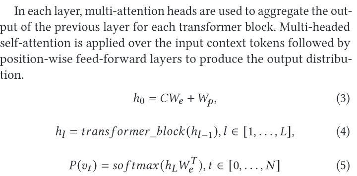
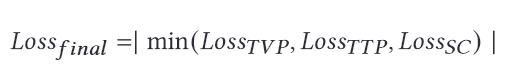
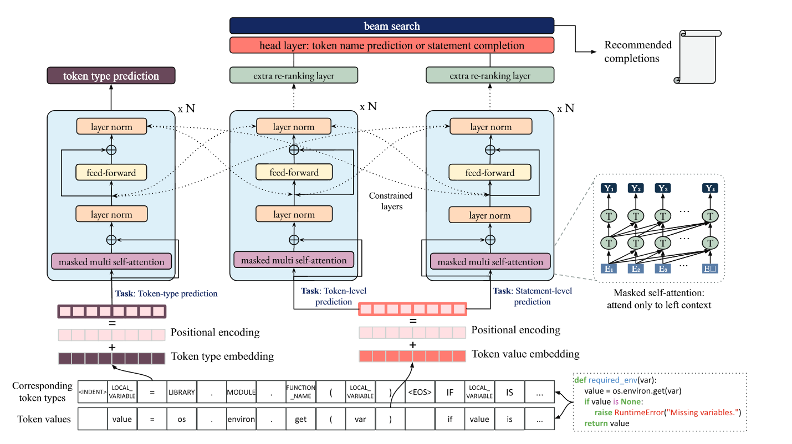

这是 CodeFill: Multi-token Code Completion by Jointly Learning from Structure and Naming Sequences 这篇文章的读书笔记

不过主要是为了写论文看的XD

<!--more-->

# Introduction

自动代码完成是在给定的上下文中预测开发者下面要输入什么，简单说下意义

讲讲当前的方法：怎么做的 有什么坏处 及时引用：

使用程序语言的特性 比如括号后面就要跟着对应的参数，坏处在于缺乏基于规则的完成

为了应对这些坏处 现在的办法是怎么做的，又引入了什么新的缺陷：

提出了一些基于统计和学习的模型 将其视为自然语言，这种办法丢失了代码结构和语义，不断引入的标识符也带来了巨大的预测空间

在这篇文章中 我们提出了xx 讲讲架构，任务，创新点，实现，应用场景 小吹一下

讲一下实验构造 简要介绍基线，任务和数据集，实验设置

讲讲结果 怎么个SOTA 最后总结贡献

主要贡献：

* 模型：基于结构和名称的模型
* 代码和数据集及训练过程
* 广泛的评估

# 背景和相关工作

写在一起了

## 背景

写的很水

* 语言模型和Transformer

  几乎没介绍什么 有点像凑字数

* 多任务学习 MTL

  简单介绍了和自己工作差不多模式的这一小领域

  多个任务，联合损失函数 应参数和软参数

## 相关工作

## 基线

# 方法

简单介绍概览 可能给个图？

包括三个部分  预处理 模型训练和 后处理

## 预处理

造出两个不同版本的输入 一个是去掉空行空格注释的原始变量名之类的

 一个是用pythonAST 处理过的token type，记录每个token的类型，值和位置

使用了BPE编码 （这还要单独拿来吹）

为了处理python的缩进 额外引入了类似括号的标记符来标明缩进

## 模型训练

分别在两个层次上进行了三种模型训练，下一个token值预测TVP 下一个token类型预测TTP 和语句完成SC

首先用一个通用的语言模型在无标签数据上取得通用参数，然后再分别再三个任务上训练。

因为token类型太少 所以划分是4：2：4，且在微调阶段只使用另外两个任务

介绍了主要模型的架构 GPT-2 真的就很呆地说了一下有什么什么层

列了一个概率分布函数

列了最优化函数/好像也就是普通的Cross-Entropy Loss

简单列了一下式子模型的

训练时每个epoch随机选择一个任务

损失在所有任务间共享，生成类任务使用波束搜索

希望能够最小化

TVP 和TTP 都是类似的训练方法，使用遮罩单向预测，即看到左侧的上文推断下个token

SC是直到<EOS>生成才会结束

波束搜索也就介绍了一下， 介绍了3，5，10的宽度尝试

训练方法：

要不要搞个这种大图（？）

## 后处理

这个部分很有意思

生成之后会重新排序列表给开发者

大概就是 每一项预测 会以<token, type, probability>的形式给出来，然后根据不同的类型会有不同的处理。

在某一个程度的局部，如果预测的是个函数，候选者中和前面来自同一类的就更有可能。

具体地说，会对前面的进行观察，然后存成一个列表，对预测列表对观察列表进行交叉检查 如果有重复，就根据预测项的类型乘以不同的权重，使其更有可能。

简单地说，就是认为变量和函数名等都有一定的聚集性，如果预测的某个在前面某种关联性出现了 那么就给他酌情更重要一些。

