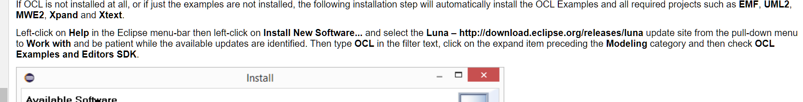
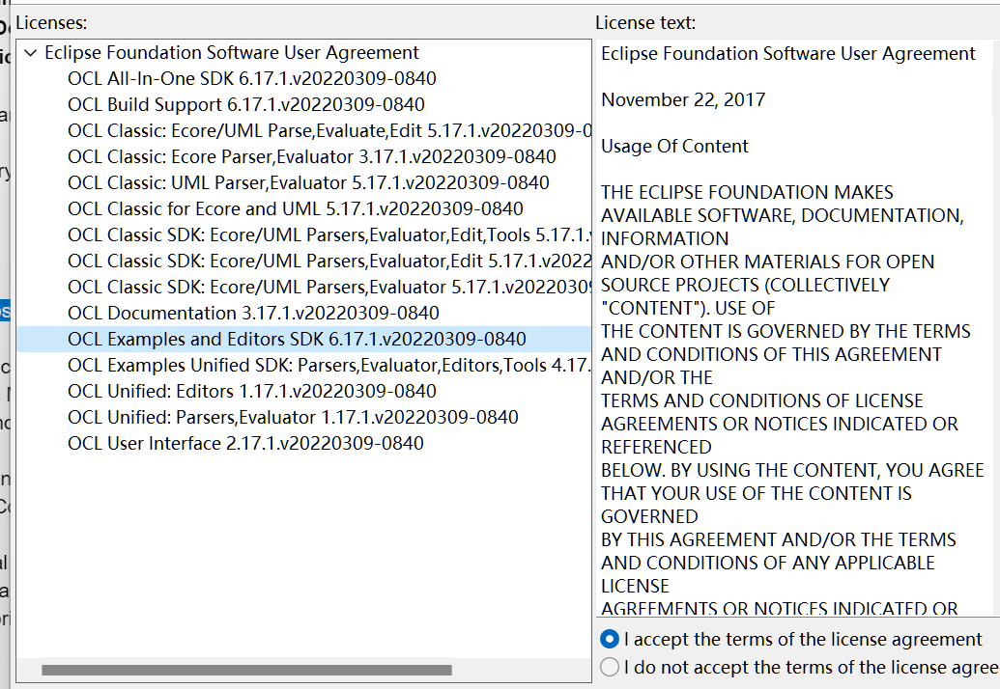
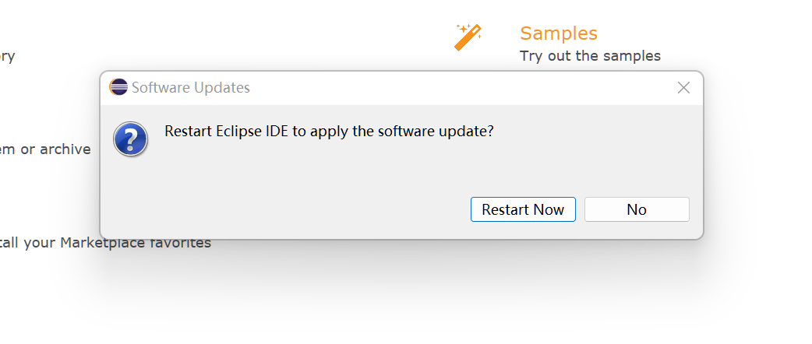

这篇文章致力于阐述如何使用Eclipse相关软件实现OCL解析的应用

<!--more-->

首先查看https://help.eclipse.org/latest/index.jsp?topic=%2Forg.eclipse.ocl.doc%2Fhelp%2FInstallation.html

发现服务提供方式是eclipse+插件 首先安装eclipse本体

官网下载有一些问题 采用镜像下载的方式

http://iso.mirrors.ustc.edu.cn/eclipse/technology/epp/downloads/release/2022-06/R/eclipse-committers-2022-06-R-win32-x86_64.zip

安装成功后 如教程所述 打开help 里面并没有 Install New Software…… （虽然后面又能找见了）

没办法 采用了help>eclipse marketplace的方法 只能安装Eclipse OCL这个插件了 看是教程里面的包都包含在里面

等待安装完成后重启

